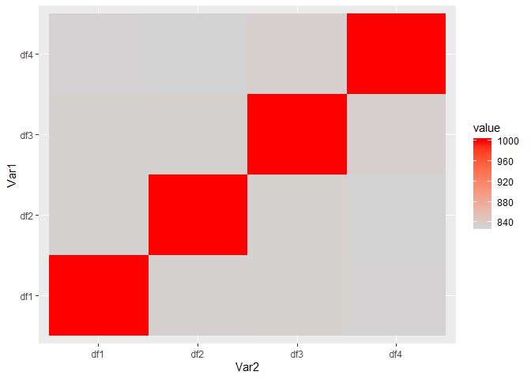
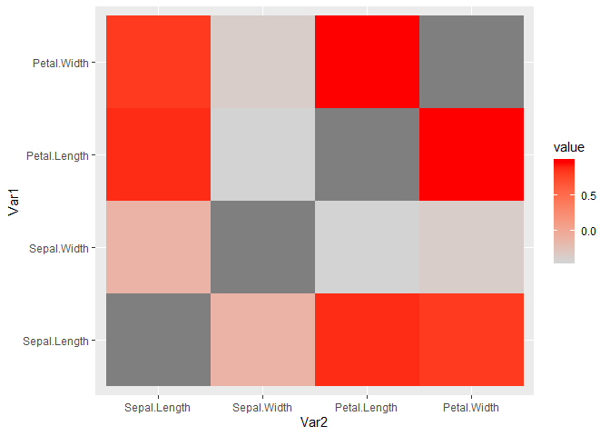

<!-- README.md is generated from README.Rmd. Please edit that file -->

# pmapply


<!-- badges: end -->

The goal of pmapply is to apply a pair-wise function over a series of
vectors.

## Installation

You can install the released version of pmapply from GitHub with:

``` r
remotes::install_github("daranzolin/pmapply")
```

## Example: What keys should I use to join my tables?

Suppose you have several tables with varying keys. Some may match, some
may partially match, and some may not match at all. Rather than
rerunning `sum(key1 %in% key2)`, `sum(key2 %in% key3)`, `sum(key1 %in%
key3)` *ad infinitum*, use `pmapply`:

``` r
library(pmapply)

generate_keys <- function(n = 1200) {
  a <- do.call(paste0, replicate(5, sample(LETTERS, n, TRUE), FALSE))
  paste0(a, sprintf("%04d", sample(9999, n, TRUE)), sample(LETTERS, n, TRUE))
}
keys <- generate_keys()
l <- list(
  k1 = sample(keys, 1000),
  k2 = sample(keys, 1000),
  k3 = sample(keys, 1000),
  k4 = sample(keys, 1000)
)

si <- function(x, y) sum(x %in% y)
m <- pmapply(l, si)
m
#>      k1   k2   k3   k4
#> k1 1000  833  835  835
#> k2  833 1000  837  835
#> k3  835  837 1000  841
#> k4  835  835  841 1000
```

The resulting matrix shows the total intersections between each
combination.

Get the minimum and maximum values with `get_min_max_combos`:

``` r
get_minmax_combos(m)
#> $max_combo
#> [1] "k4 - k3"
#> 
#> $max_value
#> [1] 841
#> 
#> $min_combo
#> [1] "k2 - k1"
#> 
#> $min_value
#> [1] 833
```

Or plot the heatmap with `combo_heatmap`:

``` r
combo_heatmap(m)
```



## Example 2: Correlation Matrices

``` r
(cormat <- pmapply(iris[,c(1:4)], function(x, y) cor(x, y)))
#>              Sepal.Length Sepal.Width Petal.Length Petal.Width
#> Sepal.Length    1.0000000  -0.1175698    0.8717538   0.8179411
#> Sepal.Width    -0.1175698   1.0000000   -0.4284401  -0.3661259
#> Petal.Length    0.8717538  -0.4284401    1.0000000   0.9628654
#> Petal.Width     0.8179411  -0.3661259    0.9628654   1.0000000
combo_heatmap(cormat)
```


