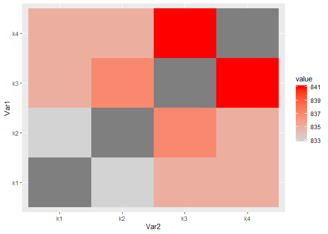

<!-- README.md is generated from README.Rmd. Please edit that file -->

# pmapply

<!-- badges: start -->

<!-- badges: end -->

The goal of pmapply is to apply a pair-wise function over a series of
vectors.

## Installation

You can install the released version of pmapply from GitHub with:

``` r
remotes::install_github("daranzolin/pmapply")
```

## Example: What keys should I use to join my tables?

Suppose you have several tables with varying keys. Some may match, some
may partially match, and some may not match at all. Rather than
rerunning `sum(key1 %in% key2)`, `sum(key2 %in% key3)`, `sum(key1 %in%
key3)` *ad infinitum*, use `pmapply`:

``` r
library(pmapply)

generate_keys <- function(n = 1200) {
  a <- do.call(paste0, replicate(5, sample(LETTERS, n, TRUE), FALSE))
  paste0(a, sprintf("%04d", sample(9999, n, TRUE)), sample(LETTERS, n, TRUE))
}
keys <- generate_keys()

df1 <- data.frame(key = sample(keys, 1000))
df2 <- data.frame(key = sample(keys, 1000))
df3 <- data.frame(key = sample(keys, 1000))
df4 <- data.frame(key = sample(keys, 1000))

si <- function(x, y) sum(x %in% y)
m <- pmapply(df1 = df1$key,
             df2 = df2$key, 
             df3 = df3$key,
             df4 = df4$key,
             show = "all",
             FUN = si)
m
#>      df1  df2  df3  df4
#> df1 1000  841  829  833
#> df2  841 1000  836  831
#> df3  829  836 1000  831
#> df4  833  831  831 1000
```

The resulting matrix shows the total intersections between each
combination.

Get the minimum and maximum values with `get_min_max_combos`:

``` r
get_minmax_combos(m)
#> | Maximum combination:  df2 - df1      |  Value:  841 
#> | Minimum combination:  df3 - df1      |  Value:  829
```

Or plot the heatmap with `combo_heatmap`:

``` r
combo_heatmap(m)
```


